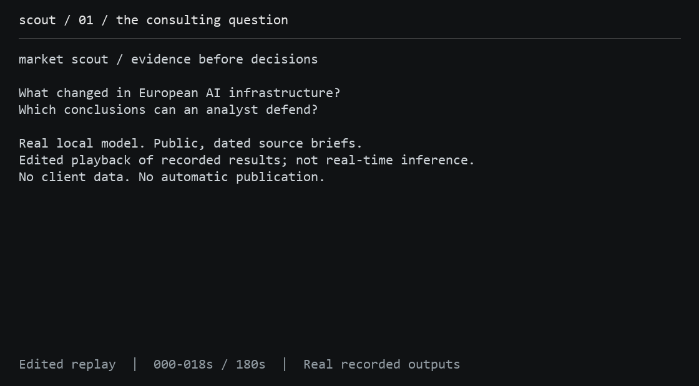
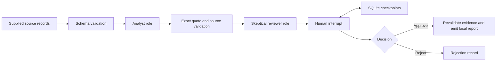

# Market Scout Agents

[](https://github.com/suprkco/market-scout-agents/actions/workflows/ci.yml)

**A terminal-first LangGraph research workflow, evaluated with a real local language model against dated public-source briefs.**

The first measured pilot found **9/9 exact quotations but three contradictory implications in AI-assisted inspection**. Adding a critic increased latency without an established quality gain. [One-page case study](docs/case-study.md) · [Protocol and raw results](docs/evaluation.md).

## Problem

Market monitoring produces claims that need attribution, scrutiny and a clear approval boundary.
This prototype turns supplied source records into a structured draft, validates quotes, collects reviewer concerns, and requires explicit human approval before creating an approved local report.

## Demo

The demo runs in the terminal with plain text output. Add `--json` for the complete machine-readable result.



[Replay script](docs/demo-script.md) · [Captured real-model draft](docs/demo-public-pending.json). This three-minute edited replay uses recorded outputs; pauses are presentation timing, not inference speed. It is not a narrated screen recording.

[Recorded draft awaiting review](docs/demo-pending.json) · [Synthetic rejected report](docs/demo-rejected.json) · [Interview walkthrough](docs/interview.md)

Default fixture input remains **fictional**, with deterministic extraction. The [public evaluation input](data/public_sources.json) is separate: three curated, attributed briefs based on real dated announcements. Local Ollama and llama.cpp backends run the analyst and critic with an actual model. Nothing is sent to Slack, email or a publishing service.

## Architecture



## Tech stack

Python, LangGraph, SQLite checkpoints, Pydantic, httpx, Ollama or llama.cpp, Qwen2.5, pytest and GitHub Actions.

## Quickstart

Docker starts the fixture workflow and stops at the human gate:

```sh
docker compose up --build
```

The checkpoint volume persists. To inspect a new run, use a new thread identifier. Resume the initial run explicitly:

```sh
docker compose run --rm scout python -m scout.cli approve --thread demo --db /state/checkpoints.db --reviewer "Your name" --note "Reviewed the synthetic source records"
```

Without Docker:

```sh
python -m venv .venv
# Activate .venv, then:
pip install -r requirements.txt -r requirements-dev.txt
python -m scout.cli run --thread interview
# Inspect the displayed draft and concerns before deciding:
python -m scout.cli reject --thread interview --reviewer "Your name" --note "Needs independent corroboration"
```

Run from the repository root. Checkpoints remain in `checkpoints.db`, which is gitignored. `.env.example` documents process configuration; variables are not automatically loaded from `.env`.

For Ollama, install a model, set `OLLAMA_URL` and `OLLAMA_MODEL`, then pass `--mode ollama`. The measured run instead uses llama.cpp and the revision-pinned Qwen2.5-0.5B checkpoint: [exact setup and reproduction](docs/evaluation.md#reproduce). Set `SCOUT_BACKEND=llamacpp` and pass `--mode model --input data/public_sources.json`. Model-format validation does not guarantee accurate analysis.

To use your own **public, non-confidential** source records, pass `--input path/to/sources.json` with the same schema as `data/synthetic_sources.json`. This prototype does not crawl the web or independently verify URLs. The configured model receives these supplied records.

## Evaluation

Real-model pilot, 1 October 2026, CPU inference on one Windows laptop:

| Measure | Observed result |
| --- | --- |
| Cases / model calls | 6 cases, 12 calls; all reached human review |
| Exact quotations / supplied source coverage | 9/9 findings; 9/9 source appearances |
| Contradictory implications | 3/9 identified by AI-assisted inspection; independent human labels pending |
| Analyst-only median / whole two-role graph median | 8.21 s / 12.53 s |
| Benefit from critic | Not established; it repeated errors and cannot edit the draft |
| Human review time / total operating cost | Not measured; local provider API charge USD 0 |

[Full protocol, timing boundaries and failure examples](docs/evaluation.md). Only three source briefs are reused across these six cases; this is not a held-out benchmark or a semantic accuracy estimate. All failed runs would be retained. No result claims that two roles outperform one.

Workflow and adapter checks, Python 3.10.4:

| Check | Observed result |
| --- | --- |
| pytest suite | 15 passed |
| Report before human review | No report emitted |
| SQLite restart, approve and reject paths | Passed |
| Fabricated quote or source ID | Rejected |
| String `"yes"` instead of a Boolean decision | Rejected |
| Evidence changed after review | Rejected |

Reproduce with `pytest -q` and `ruff check .`. These deterministic checks cover workflow and adapter correctness. The real-model pilot above is separately reproducible and does not run in routine CI.

## Design choices

- **Two roles, one reviewable state.** Analyst and skeptical reviewer have different outputs. Fixture mode makes the control flow testable without a model.
- **Quotes are checked mechanically.** Every quoted passage must occur in its identified source; a valid quote still does not prove the associated implication.
- **Human approval is a graph boundary.** LangGraph interrupts and SQLite checkpoints survive process restart. Approval requires a strict Boolean, reviewer name and note.
- **Evidence is bound to the decision.** A digest and final revalidation detect changed source/finding payloads before report creation.
- **No autonomous distribution.** The final artifact is printed locally. Approval never authorizes an external message.

## Limitations and next steps

There is no authenticated reviewer identity: this is a single-user CLI, and the local checkpoint database is trusted. Human review is not a substitute for source verification. Source text may contain prompt injections; structural validation catches unknown sources and altered quotes but not every unsupported implication. The pipeline is sequential; roles do not negotiate or independently browse.

Next: independent human labels and review timing, stronger-model comparison on unseen full articles, source prompt-injection experiments, authenticated reviewers and duplicate-event handling. No employer or client material is included. Code was developed with AI assistance. The Qwen checkpoint is attributed under Apache-2.0 and is not redistributed here.
