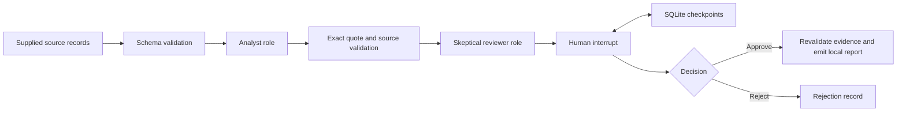

# Market Scout Agents

[](https://github.com/suprkco/market-scout-agents/actions/workflows/ci.yml)

**A LangGraph research pipeline with structured evidence, two optional LLM roles, and a persistent human review gate.**

## Problem

Market monitoring produces claims that need attribution, scrutiny and a clear approval boundary.
This prototype turns supplied source records into a structured draft, validates quotes, collects reviewer concerns, and requires explicit human approval before creating an approved local report.

## Demo

The demo runs in the terminal with plain text output. Add `--json` to the demo CLI for the complete machine-readable result.

[Recorded draft awaiting review](docs/demo-pending.json) · [Synthetic rejected report](docs/demo-rejected.json) · [Interview walkthrough](docs/interview.md)

The bundled input is **fictional**, clearly labeled synthetic demonstration data. Default fixture mode uses deterministic extraction, not model inference. It exercises the same graph, schemas, evidence validation and human gate as the optional Ollama mode. Nothing is sent to Slack, email or a publishing service.

## Architecture



## Tech stack

Python, LangGraph, SQLite checkpoints, Pydantic, httpx, optional Ollama, pytest and GitHub Actions.

## Quickstart

Docker starts the fixture workflow and stops at the human gate:

```sh
docker compose up --build
```

The checkpoint volume persists. To inspect a new run, use a new thread identifier. Resume the initial run explicitly:

```sh
docker compose run --rm scout python -m scout.cli approve --thread demo --db /state/checkpoints.db --reviewer "Your name" --note "Reviewed the synthetic source records"
```

Without Docker:

```sh
python -m venv .venv
# Activate .venv, then:
pip install -r requirements.txt -r requirements-dev.txt
python -m scout.cli run --thread interview
# Inspect the displayed draft and concerns before deciding:
python -m scout.cli reject --thread interview --reviewer "Your name" --note "Needs independent corroboration"
```

Run from the repository root. Checkpoints remain in `checkpoints.db`, which is gitignored. `.env.example` documents process configuration; variables are not automatically loaded from `.env`.

For real model calls, install an Ollama model, set `OLLAMA_URL` and `OLLAMA_MODEL`, then pass `--mode ollama`. The analyst and skeptical reviewer use separate prompts and structured schemas. This live model path has not been benchmarked; model-format validation is not a guarantee of accurate analysis.

To use your own **public, non-confidential** source records, pass `--input path/to/sources.json` with the same schema as `data/synthetic_sources.json`. This prototype does not crawl the web or independently verify URLs. The configured model receives these supplied records.

## Evaluation

Recorded locally on 2026-09-29, Python 3.10.4:

| Check | Observed result |
| --- | --- |
| pytest suite | 9 passed |
| Report before human review | No report emitted |
| SQLite restart, approve and reject paths | Passed |
| Fabricated quote or source ID | Rejected |
| String `"yes"` instead of a Boolean decision | Rejected |
| Evidence changed after review | Rejected |

Reproduce with `pytest -q` and `ruff check .`. This measures workflow correctness on fixtures, **not market-research quality, multi-agent superiority or LLM accuracy**.

## Design choices

- **Two roles, one reviewable state.** Analyst and skeptical reviewer have different outputs. Fixture mode makes the control flow testable without a model.
- **Quotes are checked mechanically.** Every quoted passage must occur in its identified source; a valid quote still does not prove the associated implication.
- **Human approval is a graph boundary.** LangGraph interrupts and SQLite checkpoints survive process restart. Approval requires a strict Boolean, reviewer name and note.
- **Evidence is bound to the decision.** A digest and final revalidation detect changed source/finding payloads before report creation.
- **No autonomous distribution.** The final artifact is printed locally. Approval never authorizes an external message.

## Limitations and next steps

There is no authenticated reviewer identity: this is a single-user CLI, and the local checkpoint database is trusted. Human review is not a substitute for source verification. Source text may contain prompt injections; structural validation catches unknown sources and altered quotes but not every unsupported implication. The pipeline is sequential; roles do not negotiate or independently browse.

Next: approved RSS ingestion with source provenance, dated public-source evaluation, authenticated reviewers, model comparison, duplicate-event handling and durable hosted checkpoints. No employer or client material is included. Code was developed with AI assistance.
